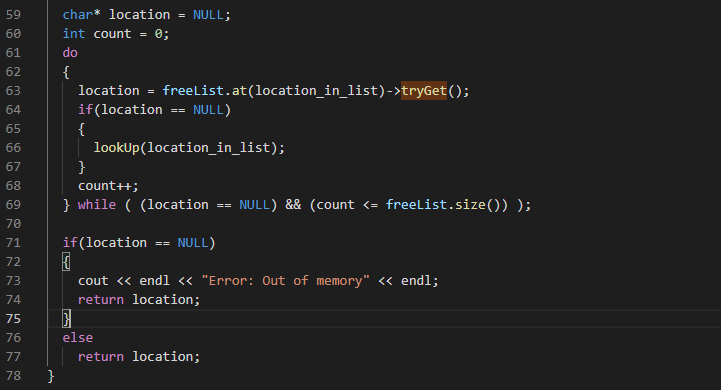

# Description
In this school assignment the task was to create a buddy-system memory allocator for a zone of memory.
This is a process that is accomplished by the OS kernel. I am simply creating the algorithm, implementing it as a C++ program to be tested 
by the Ackerman function.

## Implementation
### Basic Block Size and Free List
In this system, a section of memory is broken into smaller sections and allocated to users upon request. 
In order to manage fragmentation, a basic block size is determined. The basic block size is the minimum memory size 
that can be allocated. When a request for memory is made, the smallest available power of 2 multiple of the basic block size is given.
In order to simplify the process, an array of free memory blocks is maintained, arranged by size. The size of this list is equivalent to the number of possible
memory sizes. Here is the calculation I used to determine the size of the free list. 

### alloc()

Here is the algorithm I wrote in the alloc() function to break up the memory and allocate it to the user.

The location_in_list variable is the location in the free list where the most ideal chunk of memory will be 
located if there is one. The tryGet() function searches the linked list at that location of the free list to determine if
there is an available chunk of memory there and returns the location as a char* if there is. If not, the algorithm will look 
up the list at larger sizes of memory and will break them up and pass them down the list until there is an available chunk of memory
to give the user (this is done in the lookup() function). If nothing is found, then there is no more memory for that block-size available, and NULL is returned. 

### free()

Here is the algorithm I wrote in the alloc() function to break up the memory and allocate it to the user.

This algorithm first calculates the location of its buddy (not shown), and merges them if the buddy is free. It then looks
for the buddy of the merged chunk and if that buddy is free, merges them as well. This process happens until either all the 
memory has been returned, or there are no more free buddies to merge. 

## Comments

This implementation passed the Ackerman function with flying colors. I have not included my full solution or made my repository
for this project public since it is a current project at the University and I do not want to aid plaigarism. 
